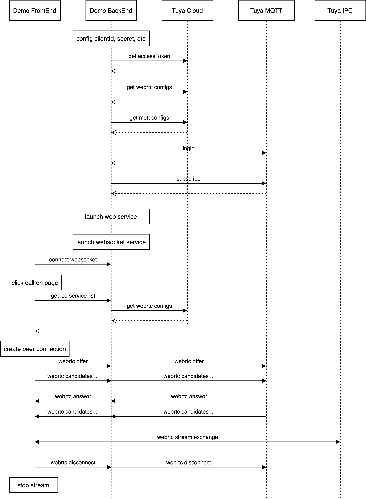

# Tuya WebRTC Web Sample接入文档

## 模块组成
### Web前端
* 提供用于Chrome访问观看设备webRTC实时流的页面
* 与Web后端通过WebSocket协议通信
* 调用Javascript API生成webRTC offer和candidate

### Web后端
* 托管Web页面
* 访问涂鸦云，通过HTTP协议获取需要的各种配置信息
* 连接涂鸦MQTT服务

### 涂鸦云
* 提供开放平台各种HTTP接口

### 涂鸦MQTT
* 提供异步的数据传输通道

### 涂鸦IPC
* 涂鸦摄像头

## Step By Step
1. 注册[Tuya开放平台](https://docs.tuya.com/zh/iot/open-api/quick-start/quick-start1)，获取`clientId`和`secret`

2. 更新Sample webrtc.json中的`clientId`和`secret`

3. 认证模式分为easy简单模式和auth授权码模式
    * easy，填写uId到webrtc.json
    * auth，访问[Tuya开放平台授权](https://openapi.tuyacn.com/selectAuth?client_id={clientId}&redirect_uri=https://www.example.com/auth&state=1234)，输入涂鸦账号和密码，同意授权，截取浏览器回调URL中的授权码`code`，填写到webrtc.json

4. 涂鸦智能APP中选中一台IPC，查询设备ID，更新到Sample webrtc.json的`deviceId`

5. 在Sample源码路径，执行`go get`后执行`go build`

6. 运行`./webrtc-demo-go`

7. Chrome打开`http://localhost:3333`，点击`Call`按钮，即可开始WebRTC会话

## Q&A
1. 获取开放平台configs后，需要将`result.source_topic.ipc`JSON字段中`/av/u/`后的字符串作为MQTT Header中的from，这样才能正确接受涂鸦MQTT服务的消息